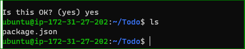
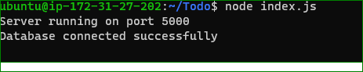
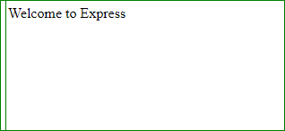
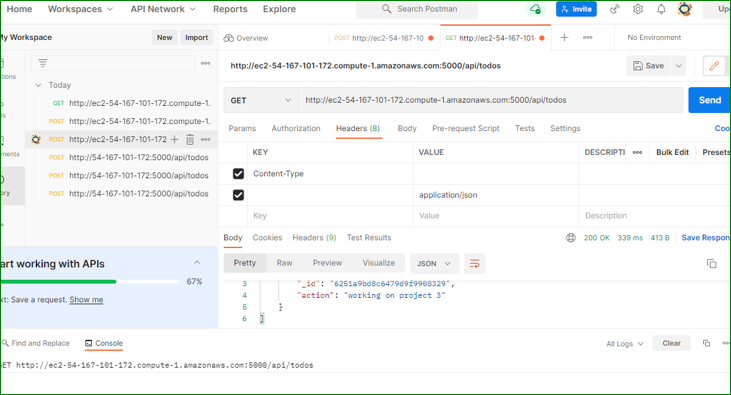
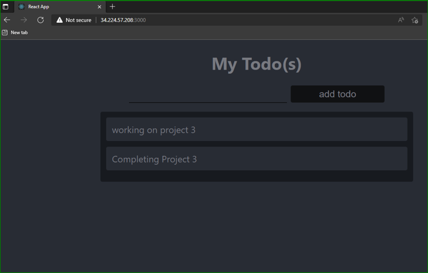

#PROJECT 3 DOCUMENTATION

`sudo apt update`

`sudo apt upgrade`

`curl -sL https://deb.nodesource.com/setup_12.x | sudo -E bash -`

`sudo apt-get install -y nodejs`

`node -v `

`npm -v`

`mkdir Todo`

`cd Todo`

`npm init`

 

`npm install express`

`touch index.js`

`npm install dotenv`

`vim index.`js`

`node index.js`

`http://<PublicIP-or-PublicDNS>:5000`

`mkdir routes`

`cd routes`

`touch api.js`

`vi api.js`

`cd Todo`

`npm install mongoose`

`mkdir models`

`cd models`

`touch todo.js`

`vim todo.js`

`cd Todo`

`touch .env`

`vi .env`

DB = 'mongodb+srv://<username>:<password>@<network-address>/<dbname>?retryWrites=true&w=majority'

`node index.js`

` npx create-react-app client`

`npm install concurrently --save-dev`

`npm install nodemon --save-dev`

`cd client`

`vi package.josn`

`npm run dev`

`cd `

`cd src`

`mkdir components`

`cd components`

`touch Input.js ListTodo.js Todo.js`

`vi Input.js`

`cd clients`

`npm install axios`

`cd src/components`

`vi ListTodo.js`

`cd src`

`vi App.js`

`vi App.css`

`vim index.css`

`cd ../..`

`npm run dev`

